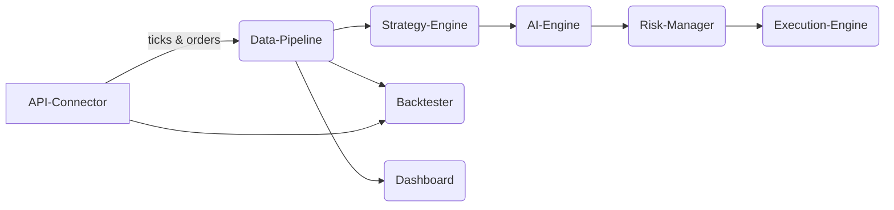

Data‑flow: real‑time tick → Strategy‑Engine → AI decision → Risk check → Execution.

Security & Compliance
– OAuth2 stored in Secrets Mgr  
– Signed orders, TLS 1.2+, IAM roles per task, FINRA OATS ready logs.
